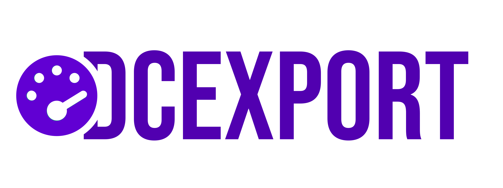

dcexport is a [Prometheus][prometheus-docs] exporter to query information about Discord guilds using a Discord bot.

## Getting Started

> [!WARNING]
> While dcexport is stable, please view the individual releases for any version-specific details that need to be
> considered while deploying. Changes are performed in adherence to [Semantic Versioning][semver-docs].

The application allows for the following configuration. Be aware, that the discord bot token is required.

| Env Variable           | Default    | Description                                                                 |
|------------------------|------------|-----------------------------------------------------------------------------|
| DCEXPORT_DISCORD_TOKEN | (required) | The token of the Discord bot that is on the guilds that should be exported. |
| DCEXPORT_LOGGING_LEVEL | info       | The logging level of the application.                                       |

## Reporting Security Issues

To report a security issue for this project, please note our [Security Policy][security-policy].

## Code of Conduct

Participation in this project comes under the [Contributor Covenant Code of Conduct][code-of-conduct].

## How to contribute

Thanks for considering contributing to this project! In order to submit a Pull Request, please read
our [contributing][contributing-guide] guide. This project is in active development, and we're always happy to receive
new contributions!

## License

This project is developed and distributed under the MIT License. See [this explanation][mit-license-doc] for a rundown
on what that means.

[prometheus-docs]: https://prometheus.io/

[semver-docs]: https://semver.org/lang/de/

[security-policy]: SECURITY.md

[code-of-conduct]: CODE_OF_CONDUCT.md

[contributing-guide]: CONTRIBUTING.md

[mit-license-doc]: https://choosealicense.com/licenses/mit/
