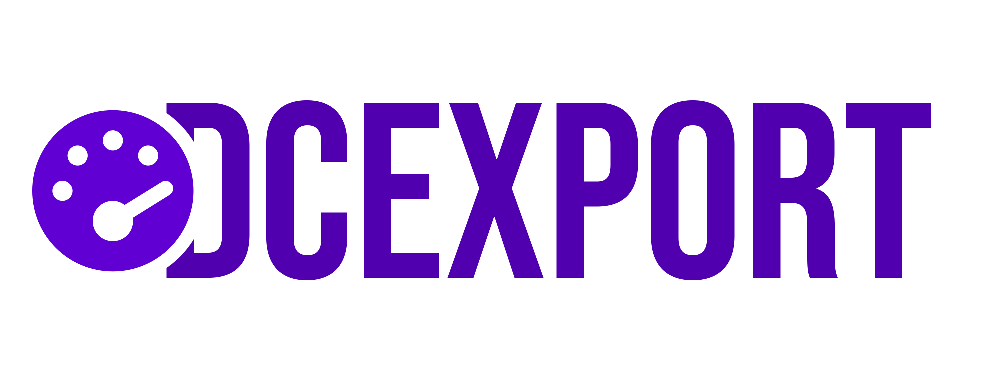

dcexport is a [Prometheus][prometheus-docs] exporter to track information about Discord guilds using a Discord bot. Unlike
many other available exporters, this exporter is written in [Rust][rust-docs] for increased stability with minimal runtime resource
requirements.

## Metrics

dcexport provides the following metrics. Every metric uses the label `guild_id` to differentiate the different guilds.
For more detailed information about the metrics and their labels, see the [source code](./src/metrics.rs).

| Name          | Description                                                                   | Type    |
|---------------|-------------------------------------------------------------------------------|---------|
| guild         | The number of guilds handled by the exporter.                                 | Gauge   |
| message_sent  | The total number of discord messages sent by guild members.                   | Counter |
| emote_used    | The total number of discord emotes reacted with by guild members in messages. | Counter |
| activity      | The number of current activities.                                             | Gauge   |
| member        | The number of members (including bots) on the guild.                          | Gauge   |
| bot           | The number of bot members on the guild.                                       | Gauge   |
| member_status | The number of members on the guild per status.                                | Gauge   |
| member_voice  | The number of members in voice channels.                                      | Gauge   |
| boost         | The number of boosts active on the guild.                                     | Gauge   |


## Getting Started

> [!WARNING]
> While dcexport is stable, please view the individual releases for any version-specific details that need to be
> considered while deploying. Changes are performed in adherence to [Semantic Versioning][semver-docs].

### Setup dcexport

Before any Discord guilds can be tracked, we first need to set up dcexport on the corresponding machine. The application
is configured using environment variables.

| Env Variable           | Default    | Description                                                                 |
|------------------------|------------|-----------------------------------------------------------------------------|
| DCEXPORT_DISCORD_TOKEN | (required) | The token of the Discord bot that is on the guilds that should be exported. |
| DCEXPORT_LOGGING_LEVEL | info       | The logging level of the application.                                       |

#### From Binaries

To run dcexport from a binary file, download the appropriate binary from our [releases][github-releases], make it
executable and run it within the shell of your choice:

```shell
chmod +x dcexport
DCEXPORT_DISCORD_TOKEN=<your-token> ./dcexport
```

#### Using Docker

To run dcexport within Docker, we can use the images that we release within our [Container Registry][github-ghcr].
Those images are hardened and provide the optimal environment to execute dcexport in a containerized environment.

```shell
docker run --rm \
  -e DCEXPORT_DISCORD_TOKEN=<your-token> \
  -p 8080/tcp \
  --name dcexport \
  ghcr.io/scrayosnet/dcexport:latest
```

#### Using Kubernetes

There's currently no public [Helm Chart][helm-chart-docs] for dcexport. We're open for contributions! In the meantime,
you can create your own deployment using [Kustomize][kustomize-docs] or any other tooling of your choice.

### Check Setup

To verify whether everything works as expected, we can invoke the following command on the same machine and observe the
reported result:

```shell
curl --request GET -sL --url 'http://localhost:8080/'
```

If the result shows any metrics, dcexport is now setup successfully and can be used to track Discord guilds.

### Configure Prometheus

Now that dcexport is working as expected, we need to configure Prometheus to track any Discord guilds. Depending on the
individual setup, this can be done in one of those ways:

#### Normal Configuration

In a normal (non-Kubernetes) deployment of Prometheus, we can track any Discord guild with a scrape
configuration like this:

```yaml
scrape_configs:
- job_name: "dcexport"
  scrape_interval: 60s
  scrape_timeout: 30s
  metrics_path: /metrics
  scheme: http
  static_configs:
    - targets:
      - dcexport:8080
```

#### CRD-based Configuration

Assuming, there's a namespace `dcexport` with a deployment of dcexport, and a corresponding service `dcexport` is in
that namespace, that exposes the dcexport instances internally, we can track metrics with this CRD configuration
using the [ServiceMonitor][servicemonitor-docs] resource:

```yaml
apiVersion: monitoring.coreos.com/v1
kind: ServiceMonitor
metadata:
  name: dcexport
  namespace: dcexport
spec:
  endpoints:
    - port: metrics
      path: /metrics
      interval: 30s
```

Depending on your setup, you may also need to add a label, so that the configuration is picked up by your Prometheus
instance. If you've installed it through the `kube-prometheus-stack` helm chart, it could, for example, be
`release: kube-prometheus-stack`. You can check the required labels in your Prometheus CRD.

## Reporting Security Issues

To report a security issue for this project, please note our [Security Policy][security-policy].

## Code of Conduct

Participation in this project comes under the [Contributor Covenant Code of Conduct][code-of-conduct].

## How to contribute

Thanks for considering contributing to this project! In order to submit a Pull Request, please read
our [contributing][contributing-guide] guide. This project is in active development, and we're always happy to receive
new contributions!

## License

This project is developed and distributed under the MIT License. See [this explanation][mit-license-doc] for a rundown
on what that means.

[prometheus-docs]: https://prometheus.io/

[semver-docs]: https://semver.org/lang/de/

[rust-docs]: https://www.rust-lang.org/

[security-policy]: SECURITY.md

[code-of-conduct]: CODE_OF_CONDUCT.md

[contributing-guide]: CONTRIBUTING.md

[kustomize-docs]: https://kustomize.io/

[github-releases]: https://github.com/scrayosnet/dcexport/releases

[github-ghcr]: https://github.com/scrayosnet/dcexport/pkgs/container/dcexport

[servicemonitor-docs]: https://github.com/prometheus-operator/prometheus-operator/blob/main/Documentation/api.md#servicemonitor

[helm-chart-docs]: https://helm.sh/

[mit-license-doc]: https://choosealicense.com/licenses/mit/
